# 👁️ NetramNova: The Ultimate AI Retinal Screening Platform

**NetramNova** is an advanced, production-grade clinical AI platform designed to detect, classify, and explain Diabetic Retinopathy (DR) using fundus photography. 

Unlike traditional "black-box" AI systems that simply output a classification grade, NetramNova bridges the trust gap between AI and medical professionals by layering **Deterministic Clinical Auditing** (based on ETDRS clinical rules) over a Deep Learning convolutional backbone.

---

## 🚀 1. The Core Innovation & Uniqueness

The primary uniqueness of NetramNova lies in its **Hybrid AI-Clinical Architecture**. 

1. **The "Black Box" Problem**: Standard CNNs (Convolutional Neural Networks) are opaque. A doctor won't trust an AI that says "Severe DR" without showing *why*. Furthermore, CNNs often miss tiny, single-pixel microaneurysms (MAs) because they get lost during aggressive down-sampling (e.g., resizing a 2000px image to 512px).
2. **The NetramNova Solution**: We use a powerful CNN (EfficientNet-B2) for global feature extraction. We then generate a **Grad-CAM Saliency Map** to see exactly *where* the CNN was looking. We extract distinct lesion clusters from this heatmap, map them to retinal quadrants, and pass them through a deterministic **Clinical Rule Engine**.
3. **The Audit**: If the CNN predicts "Normal" but the Clinical Engine finds an isolated microaneurysm, the system *overrides* the AI and upgrades the grade to "Mild DR". If the CNN predicts "Moderate" but the Engine detects lesions distributed across all 4 quadrants, it overrides the AI and upgrades to "Severe DR" (ETDRS 4-2-1 Rule).

This creates an **Explainable, Deterministic, and Trustworthy** clinical tool.

---

## 🛠️ 2. Comprehensive Tech Stack

### Frontend (Client-Side)
- **Framework**: Next.js (App Router), React 18, TypeScript.
- **Styling**: Tailwind CSS for sleek, glassmorphism-inspired dark/light modes.
- **Interactive UI**: HTML5 Canvas API for pixel-perfect, real-time image manipulation.
  - Custom implementations for Brightness/Contrast/Zoom (Loupe).
  - Real-time **Red-Free (Structural) filtering** (Foracchia Normalization + CLAHE) via Canvas pixel manipulation.
  - Dynamic overlay plotting for AI lesion coordinates using mathematically perfect percentage mapping.
- **Icons**: Lucide React.

### Backend (Server-Side Node.js)
- **API Routing**: Next.js Serverless Edge/Node routes (`route.ts`).
- **Integration**: Spawns asynchronous child processes (`execFile`) to securely execute the Python ML environment.

### Machine Learning Pipeline (Python)
- **Deep Learning**: PyTorch (Inference), Timm (EfficientNet-B2 pretrained weights).
- **Computer Vision**: OpenCV (cv2) for image processing, cropping, Ben Graham standardization.
- **Augmentation**: Albumentations for standardized tensor transformations.
- **Explainability**: Custom Grad-CAM (Gradient-weighted Class Activation Mapping) engine.

---

## 🔄 3. End-to-End System Flowchart

```mermaid
sequenceDiagram
    participant User as Doctor / Tech
    participant UI as Next.js Frontend
    participant API as Node.js API Route
    participant Preproc as Python (Preprocessing)
    participant CNN as PyTorch (EfficientNet)
    participant Audit as Python (Clinical Auditor)
    
    User->>UI: Uploads Raw Fundus Image
    UI->>API: POST /api/classify (base64 image)
    API->>API: Writes temp image to disk
    API->>Preproc: Spawns inference_service.py
    
    rect rgb(30, 41, 59)
        Note over Preproc,Audit: ML Pipeline Execution
        Preproc->>Preproc: Circular Crop (Removes black borders)
        Preproc->>Preproc: Resize to 512x512 (INTER_AREA)
        Preproc->>Preproc: Ben Graham Filtering (Lighting standardization)
        Preproc->>CNN: Passes 512x512 Tensor
        CNN-->>Preproc: Returns Raw Probabilities (Classes 0-4)
        CNN->>Audit: Generates Grad-CAM Heatmap
        
        Audit->>Audit: Extracts Lesion Contours from Heatmap
        Audit->>Audit: Maps lesions to 4 Retinal Quadrants
        Audit->>Audit: Runs ETDRS 4-2-1 & MA Rescue Rules
        Audit-->>API: Returns JSON (Final Grade, Bounding Boxes, Overlays)
    end
    
    API->>UI: Forwards JSON response
    UI->>User: Renders Multi-Viewport Dashboard
```

---

## 🔬 4. Minute Details of the ML Pipeline

### Phase 1: Preprocessing & Standardization
Fundus cameras produce highly varied images (different lighting, different crops, dark borders).
1. **Circular Masking**: `crop_fundus_circle()` detects the exact boundaries of the retina using Otsu's thresholding and contour detection. It crops out the useless black borders, ensuring the ML model only looks at tissue.
2. **Ben Graham Standardization**: Fundus images often suffer from uneven illumination (bright in the center, dark at the edges). We apply a heavy Gaussian Blur to a copy of the image and subtract it from the original (`cv2.addWeighted`). This mathematically flattens the lighting across the entire retina.

### Phase 2: CNN Inference & Saliency
The standardized 512x512 image is passed through EfficientNet-B2. 
- The model outputs a raw prediction (0: Normal, 1: Mild, 2: Moderate, 3: Severe, 4: Proliferative).
- We hook into the final convolutional layer of the model to generate a **Grad-CAM Heatmap**. This creates a topographical map showing exactly which pixels influenced the model's decision.

### Phase 3: Clinical Auditing (The Secret Sauce)
The Grad-CAM heatmap is thresholded into distinct physical "blobs" (lesions).
1. **Quadrant Mapping**: The image is split into a mathematical crosshair (Superotemporal, Superonasal, Inferotemporal, Inferonasal). Lesions are assigned to quadrants.
2. **Rule 1 (Microaneurysm Rescue)**: If the CNN predicted "0 (Normal)" but the system isolates a tiny, high-confidence hotspot, it overrides the AI and outputs "1 (Mild)".
3. **Rule 2 (ETDRS Rule 4)**: If the CNN predicted "2 (Moderate)" but the system detects >= 20 lesions spread across all 4 quadrants, clinical guidelines state this is actually Severe DR. The system overrides the AI and outputs "3 (Severe)".

---

## 🖥️ 5. Minute Details of the Frontend Architecture

### The Multi-Viewport Analysis Engine
When the results return, the frontend doesn't just show text. It mounts a sophisticated clinical dashboard with four synchronised views.

1. **The Canvas Engine**: `FundusCanvas.tsx` is the heart of the UI. It doesn't use simple `` tags. It renders the image onto a `<canvas>`, applies a perfect circular clipping mask, and plots interactive UI elements on top of the pixels.
2. **Coordinate Unification**: The ML pipeline returns lesion bounding boxes as **percentages** (e.g., `X: 45.2%, Y: 60.1%`). The `FundusCanvas` dynamically scales these percentages to fit perfectly over the eye, regardless of whether the user is looking at the heavily cropped ML input or the uncropped Raw image.
3. **Real-time Structural Mode**: Doctors often need a "Red-Free" image to spot hemorrhages. Instead of asking the backend to generate this, the Next.js frontend uses JavaScript to loop through every pixel in the canvas, strip out the red channel, amplify the green channel, and apply a local CLAHE-like contrast boost in real-time within the browser.

### The UI/UX Aesthetic
- **Visual Hierarchy**: Uses deep space navys (`bg-slate-950`) contrasted with highly saturated, glowing semantic colors (Emerald for healthy/verified, Rose for severe risk, Cyan for interactive elements).
- **Glassmorphism**: UI panels overlay the images using subtle transparency and backdrop blurs (`backdrop-blur bg-slate-900/90`).
- **Data Density**: Packs complex clinical rules (like the ETDRS grid status) into tightly designed, monospaced dashboard widgets that feel like a high-end aviation or medical terminal.
