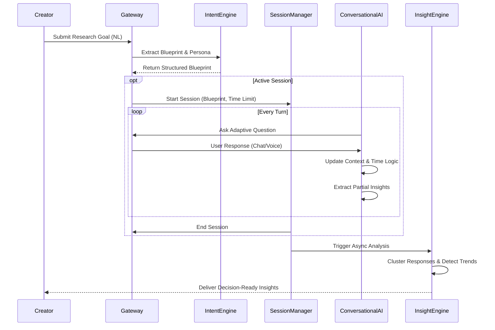

# Architecture Design: Adaptive Conversational Survey AI

This document outlines the complete end-to-end architecture for a next-generation AI-powered survey platform. It is designed to replace static forms with dynamic, adaptive, and intent-aware multilingual interviews that yield decision-ready insights.

---

## 1. Full System Architecture

The system utilizes an event-driven, microservices-oriented architecture to ensure low latency during conversational loops and scalable processing for complex insight generation.

### High-Level Components

*   **Client Interfaces**
    *   **Creator Studio (Web):** Dashboard for defining research goals, viewing insights, and managing surveys.
    *   **Respondent Interface (Web/Mobile):** Lightweight client supporting chat and voice interactions with real-time UI updates.
*   **API Gateway & Routing Layer**
    *   Handles authentication, rate-limiting, and routes HTTP/WebSocket traffic.
*   **Core Backend Services**
    *   **Survey Management Service:** Handles CRUD for survey configurations, intent processing, and metadata.
    *   **Session Engine:** Manages active interviews, tracking time, respondent state, and interaction turns.
    *   **Real-time Communication Layer:** WebSocket/WebRTC server maintaining live connections with respondents.
*   **AI Engine Layer**
    *   **Conversational Orchestrator:** Manages LLM context, prompt injection, and tool calling for the active interview.
    *   **Intent & Insight Agents:** Specialized background agents for analyzing creator prompts and aggregating respondent data.
*   **Data & Memory Layer**
    *   **Short-term Memory:** Redis for millisecond access to active session context and conversation history.
    *   **Primary Database:** PostgreSQL for transactional data (users, surveys, sessions).
    *   **Vector Database:** For semantic clustering and real-time survey evolution based on past responses.

---

## 2. AI Engine Design

The AI Engine is divided into specialized sub-systems rather than relying on a single monolithic LLM call.

### Intent-Aware Survey System
When a creator inputs a research goal, the **Intent Extraction Agent** processes the natural language to generate a **Survey Blueprint**. This JSON structure identifies:
*   `primary_objective`: The core business or research goal.
*   `information_goals`: A list of required data points or themes to explore.
*   `depth_matrix`: How deep to probe on specific topics vs. skimming others.
*   `target_decisions`: What decisions this data will support, guiding the AI's relevance filter.

### Multilingual Intelligence
*   **Native Processing:** Relies on frontier LLMs (e.g., GPT-4o, Claude 3.5) with inherent cross-lingual capabilities, avoiding fragile translation layers.
*   **Dynamic Language Detection:** The system continuously monitors user input language (including code-switching like Hinglish) and updates a `language_style` state variable.
*   **Prompt Alignment:** System prompts strictly enforce that the AI must mirror the user's language, dialect, and cultural nuance naturally.

### Dynamic Question Rewriting & Adaptation
There is no static question bank. Instead, the **Question Generator Agent**:
1.  Selects the next pending `information_goal`.
2.  Reviews the current context and `language_style`.
3.  Synthesizes a brand new question tailored to the immediate conversation flow.
4.  If a user gives a vague answer, the agent dynamically generates a clarifying follow-up.

### Persona-Based Behavior
Personas are defined via system prompt templates that dictate:
*   **Tone & Vocabulary:** Formal vs. Casual.
*   **Empathy Level:** HR-style (high empathy) vs. Academic (objective).
*   **Pacing:** Narrative (conversational transitions) vs. Analyst (direct and structured).
The selected persona modifies the final output generation layer for every turn.

### Time-Constrained Logic
A **Time Manager Module** injects current time data into the AI's context window.
*   **State variables:** `time_elapsed`, `time_remaining`, `goals_completed`, `goals_pending`.
*   **Logic:** If `time_remaining` is low but `goals_pending` is high, the system automatically instructs the LLM to skip deep probing and prioritize rapid-fire high-level questions to ensure completion.

---

## 3. Data Flow Architecture

The data lifecycle follows a distinct flow from creation to insight generation.

---

## 4. Conversation Loop Design

The core loop for a single interaction turn operates in four distinct phases:

1.  **Ingestion & State Update:**
    *   Receive user input (transcribe if voice).
    *   Update `time_elapsed`.
    *   Detect any language/style shifts.
2.  **Interpretation (Reasoning Phase):**
    *   Evaluate the response against the current `information_goal`.
    *   *Decision Gate:* Does this answer the goal?
        *   *If Yes:* Extract the structured data point and mark goal completed.
        *   *If No/Partial:* Mark for follow-up.
3.  **Strategy Formulation:**
    *   Check `time_remaining`.
    *   Determine next action: `AskFollowUp`, `MoveToNextGoal`, or `ConcludeSession`.
4.  **Generation & Delivery:**
    *   Synthesize the response/question using the active Persona profile and Language Style.
    *   Stream response back to client (with TTS if voice is active).

---

## 5. Database Schema Design

The schema is designed to separate flexible conversational data from structured analytics data.

**`Users` Table**
*   `id` (UUID, PK)
*   `email` (String)
*   `role` (Enum: Creator, Admin)

**`Surveys` Table**
*   `id` (UUID, PK)
*   `creator_id` (UUID, FK)
*   `raw_goal` (Text)
*   `blueprint` (JSONB) - Contains goals, persona config, logic.
*   `time_limit_mins` (Integer)

**`Sessions` Table**
*   `id` (UUID, PK)
*   `survey_id` (UUID, FK)
*   `respondent_id` (String/Anonymous UUID)
*   `status` (Enum: InProgress, Completed, Abandoned)
*   `detected_language` (String)
*   `start_time`, `end_time` (Timestamp)

**`Messages` Table (Append-only Transcript)**
*   `id` (UUID, PK)
*   `session_id` (UUID, FK)
*   `role` (Enum: Assistant, User, System)
*   `content` (Text)
*   `timestamp` (Timestamp)

**`Extracted_Data_Points` Table**
*   `id` (UUID, PK)
*   `session_id` (UUID, FK)
*   `survey_id` (UUID, FK)
*   `information_goal_id` (String)
*   `extracted_value` (JSONB)
*   `confidence_score` (Float)

**`Insights` Table**
*   `id` (UUID, PK)
*   `survey_id` (UUID, FK)
*   `insight_type` (Enum: Theme, Contradiction, Recommendation)
*   `content` (Text)
*   `supporting_session_ids` (Array of UUIDs)

---

## 6. Insight Generation System

The ultimate goal of the platform is to eliminate manual data analysis. The Insight Engine runs asynchronously and continuously refines its findings.

*   **Extraction over Tabulation:** Instead of counting multiple-choice answers, the system uses LLMs to extract structured facts (`Extracted_Data_Points`) from messy conversational transcripts.
*   **Semantic Clustering:** As data points accumulate, text embeddings (e.g., `text-embedding-3-small`) are generated. An algorithm like HDBSCAN clusters these embeddings to dynamically discover emergent themes without predefined tags.
*   **Contradiction & Anomaly Detection:** An evaluator LLM reviews the dominant clusters against each other to identify friction points (e.g., "Users strongly desire feature X, but cluster Y indicates they find the current interface too complex, suggesting feature X might worsen UX").
*   **Decision-Oriented Synthesis:** The final step maps the discovered themes and contradictions back to the original `target_decisions` defined in the Blueprint, outputting concise, actionable business recommendations.

---

## 7. Tech Stack Recommendation

This stack is optimized for AI workloads, real-time streaming, and scalable data processing.

**Frontend (Creator & Respondent):**
*   **Framework:** Next.js (React)
*   **State Management:** Zustand
*   **Styling:** Tailwind CSS (paired with custom "Glacier" design system)
*   **Voice/Audio:** Web Audio API & RecordRTC

**Backend & API:**
*   **Framework:** Python with FastAPI (Ideal for async AI/ML workloads and integration with Python-first AI libraries) or Node.js with NestJS.
*   **Real-time:** WebSockets (native FastAPI WebSockets or Socket.io if Node).

**AI & Machine Learning:**
*   **Orchestration:** LangChain or LlamaIndex.
*   **Core LLMs:** OpenAI GPT-4o or Anthropic Claude 3.5 Sonnet (for high-speed, multilingual reasoning).
*   **Embeddings:** OpenAI `text-embedding-3-small` or Cohere multilingual.
*   **Voice Models:** Whisper API (STT), ElevenLabs (high-fidelity TTS).

**Data Layer:**
*   **Primary Database:** PostgreSQL (Supabase or AWS RDS).
*   **Vector Database:** pgvector (inside PostgreSQL) for simplicity, or Pinecone for extreme scale.
*   **In-Memory / Session State:** Redis (Upstash).
*   **Task Queue:** Celery (Python) or BullMQ (Node) backed by Redis for Insight Generation background tasks.
