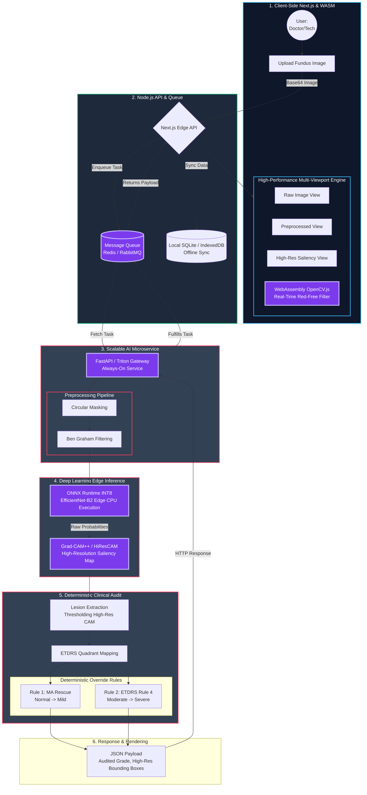

# NetramNova Proposed Next-Gen Architecture Flowchart

This flowchart outlines the **proposed production-ready architecture** based on our discussion, incorporating the scalability, performance, and explainability improvements (WASM, FastAPI, Grad-CAM++, and ONNX Runtime).

### Key Improvements in this Proposed Flow:

1. **WebAssembly (WASM) Frontend Integration**: Instead of heavy JavaScript Canvas loops, the UI uses `OpenCV.js` (WASM) to process the structural Red-Free view at near-native C++ speeds, preventing stuttering on low-end clinic tablets.
2. **Message Queue / FastAPI Decoupling**: The architecture now routes inference jobs through a Message Queue (like Redis) into a highly scalable `FastAPI` or `Triton` gateway, rather than direct synchronous HTTP requests. This prevents server crashes during traffic spikes.
3. **ONNX Edge CPU Inference**: The CNN is explicitly ported to run on `ONNX Runtime` with INT8 quantization, massively speeding up processing on cheap clinic hardware without needing GPUs.
4. **Grad-CAM++ / HiResCAM**: Standard Grad-CAM is replaced with high-resolution explainability algorithms, fixing the issue where tiny Microaneurysms get lost in blurry heatmaps and ensuring the Clinical Audit engine has perfect spatial coordinates.
